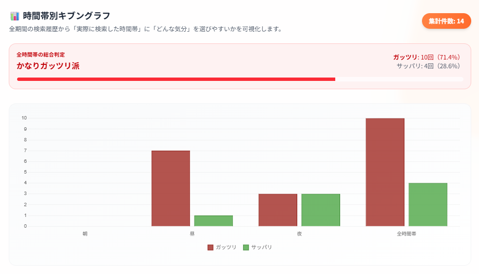
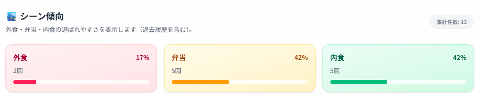
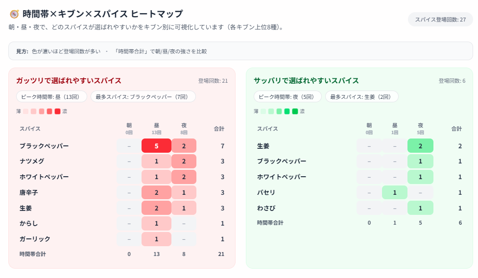
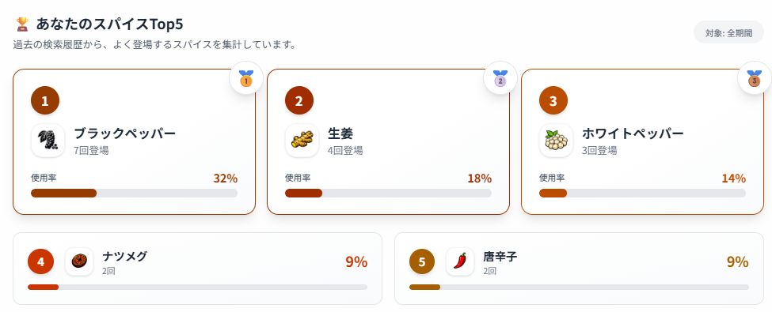
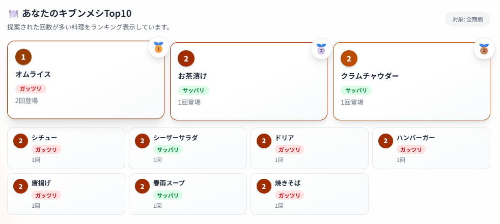

# キブンメシ　
 
 
サービスURL：https://kibunmeshi.onrender.com/

## サービス概要
**～あなたのキブンに合わせたメシを最短1秒で提案するアプリ～**
 
　「食べたい」欲望として、「ガッツリ」「サッパリ」、ジャンル(「中華」「イタリアン」etc)、「弁当にあと1品」など漠然と求めるものはあるけど、
何が食べたいか分からない/優柔不断で決められない/マンネリ化していてたまには違うものを食べたい
そんな時に後押ししてくれるサービス

## 制作背景・理由
- **日々の食事のマンネリ化・優柔不断解消** 
　かつてスパイスメーカーで働いており、日々さまざまな香辛料や味の組み合わせを提案してきた 
　そんな私でも朝メシ、昼メシ(弁当)、晩メシのメニューはマンネリ化、家族での外食も３件くらいをローテーションする日々であり、「何食べたい？」と聞いても答えが返ってこない、「何食べたい？」と聞かれても答えを返せず、“決める”ことに疲れてしまう瞬間はある 
　そうした日々の食のマンネリ化を解消したく、このサービスを考案 
 

## ユーザー層について
- **料理のレパートリーの少ない20～30歳代夫婦** 
理由: レパートリーの少ない夫婦の日々の料理のマンネリ化解消のため 
 
- **優柔不断で食べたいを決められない10～30歳代男女** 
理由: 食べたいものを聞かれた際の「欲望はあるけど何を食べたいか分からない」といったストレス解消(カップルの飲食店探しや家族の出先での急な外食時のアイデア出し)のため

### ペルソナ
|項目|内容|
|---|---|
|**基本属性**| 年齢：30歳/性別：男/職業：公務員/家族構成：妻(28歳)、子(1歳)|
|**趣味・ライフスタイル**|趣味：料理 / ライフスタイル：昼は弁当、土日は子ども時間|
|**購買行動**|新しいもの好き、トレンドへの感度高い|
|**目標・悩み**|日々の悩み：毎日のご飯のマンネリ化|

## 主な機能
### 最短１秒で「キブン」に合った「メシ」にたどり着ける

| PCイメージ | スマホイメージ |
| :---: | :---: |
|  |  |
| 
PC画面で検索条件を指定し料理を提案するUI
 | 
スマートフォン画面でも同様に検索可
 |
※以降はスマホ操作想定がメインのためスマホ画面のみ提示する

### 条件検索 
条件(カテゴリ、スパイス・ハーブ、シーン、味覚・刺激、時間帯、季節感、ジャンル)を項目ごとに最大１つずつ選んで検索

## ログイン後機能
| 検索履歴 | 検索傾向 |マイページ|
| :---: | :---: | :---: |
||||

検索傾向には、以下４つの機能を実装
- 時間帯別キブングラフ  

- シーン傾向  

- 時間帯×キブン×スパイス ヒートマップ  

- あなたのスパイスTop5  

- あなたのキブンメシTop10  

## サービスの差別化ポイント・推しポイント
### レシピアプリ・飲食店アプリとの差別化
| アプリ | 💡キブンメシ | 👨‍🍳レシピアプリ | 🍽️飲食店アプリ |
| :---:| :---: | :---: | :---: |
| 検索条件 | キブン・詳細条件 | 食材・料理名 | 場所・ジャンル |
| 選択方法 | 選択 | 選択・自由記述 | 選択・自由記述 |
| 検索結果 | １つ | 複数 | 複数 |

### 推しポイント
- 条件で選択するため検索結果がブレない(レシピアプリや飲食店アプリのように表記や口コミなどに左右されない)
- 検索結果をあえて１つにすることで優柔不断な人にも最短１秒でその日のメシを決められる

#### 料理データの管理方針
* 料理の条件タグは `category_contents` に統合して管理
* 主なラベル: 気分 / 時間帯 / シーン / 季節 / ジャンル / 味覚・刺激 / スパイス・ハーブ
* seedで初期データを投入・更新

## メール送信設定
* development / test / production で `deliver_later` を使う。production は `ActiveJob :async` でリクエスト外送信する。
* 本番送信には専用 Gmail `noreply.kibunmeshi@gmail.com` を使用(Gmail API)
* 必要な環境変数は `MAILER_SENDER`、`GMAIL_API_CLIENT_ID`、`GMAIL_API_CLIENT_SECRET`、`GMAIL_API_REFRESH_TOKEN` である。

## 本番の管理者画面
* 管理画面の URL は `/admin`。
* 本番では `ADMIN_EMAIL` と `ADMIN_PASSWORD` を設定すると、起動時に管理者ユーザーを自動で作成または管理者へ昇格する。
* `ADMIN_NAME` を指定すると表示名も更新される。
* 既存ユーザーのパスワードは通常維持し、デプロイ時に更新したい時だけ `ADMIN_FORCE_PASSWORD_UPDATE=true` を使う。

## 機能の実装方針

### 料理検索
- トップ画面では「ガッツリ / サッパリ」の気分から `Dish.random_by_category` で料理を1件ランダム提案する。
- 詳細検索ではキーワード、シーン、時間帯、季節、ジャンル、味覚・刺激、スパイス・ハーブを組み合わせ、`Dish.search_by_conditions` で絞り込んだうえで1件を表示する。

### 条件タグとデータ管理
- 料理の条件タグは `categories` と `category_contents` に統合し、`label` で「気分 / 時間帯 / シーン / 季節 / ジャンル / 味覚・刺激 / スパイス・ハーブ」を判別する。
- スパイス対応は `config/spice_pairings.yml` で管理し、`db/seeds.rb` と `seed_runs` で初期データの投入・更新を管理する。
- 本番では `Dish.ensure_condition_labels_integrity!` により、ラベルの正規化、不足しているシーン・味覚タグの補完、スパイス関連付けの同期を行う。

### ログイン後機能
- ログインユーザーの検索条件は `search_histories.query_params` に JSONB で保存し、提案した料理と実行時刻も合わせて記録する。
- 検索履歴一覧は `Kaminari` でページネーションして表示し、個別削除にも対応する。
- 検索傾向画面では、時間帯別キブングラフ、時間帯×キブン×スパイス分析、シーン傾向、スパイスTop5、キブンメシTop10 をサーバー側で集計して表示する。
- 傾向データは `Rails.cache` を使って5分間キャッシュし、表示側では `Chart.js` を CDN から読み込んでグラフ描画する。

### 認証・アカウント
- 認証は `Devise` を利用し、メールアドレス/パスワード認証に加えて `OmniAuth Google OAuth2` によるGoogleログインに対応する。
- マイページではユーザー名とメールアドレスを更新できる。
- パスワードリセットメールは `deliver_later` で非同期送信する。

### フロントエンド・モバイル対応
- 画面は `ERB` と `Tailwind CSS` を中心に構築し、`Turbo` と `Stimulus` で軽量な操作性を実装する。
- PWA 用の manifest / service worker を配信し、ホーム画面追加後は standalone 表示で利用できる。
- 結果画面では提案された料理名をもとにクラシルの検索結果へ遷移できる。
- 食べログ導線ではブラウザの位置情報を使い、現在地付近の店を検索できる。

### 通知・画像・開発運用
- 本番メール送信は Gmail API を使う独自 delivery method で実装し、開発環境では `Letter Opener Web` を利用する。
- 料理画像は `Active Storage` で管理し、seed 実行時にはプレースホルダー SVG を自動付与する。
- ローカル開発環境は `Docker Compose` + `PostgreSQL 15` を前提とする。

### 技術一覧

| 区分 | 採用技術 | 用途 |
| --- | --- | --- |
| バックエンド | Ruby 3.3.0 / Ruby on Rails 7.2.3 | アプリケーション本体、MVC、Active Record、Action Mailer |
| フロントエンド | ERB / Hotwire（Turbo, Stimulus） / Importmap | 画面描画、画面遷移高速化、軽量JavaScript |
| UI / アセット | Tailwind CSS 4.4 / Propshaft | UI構築、CSS管理、アセット配信 |
| データベース | PostgreSQL 15 | 料理、カテゴリ、検索履歴などの永続化 |
| 認証 | Devise / OmniAuth Google OAuth2 | メールアドレス認証、Googleログイン、パスワードリセット |
| 検索ロジック | Active Record による独自検索実装 | `Dish.search_by_conditions` と `category_contents` ベースの条件検索 |
| 履歴・分析 | Kaminari / Rails.cache（memory_store） / Chart.js（CDN） | 検索履歴のページネーション、傾向集計のキャッシュ、グラフ描画 |
| 通知 | Active Job（`:async`） / Gmail API / Letter Opener Web | パスワードリセットメールの非同期送信、本番・開発の配送切替 |
| 画像・PWA | Active Storage / Web App Manifest / Service Worker | 料理画像管理、ホーム画面追加対応 |
| 外部連携 | クラシル / Nominatim（OpenStreetMap） / 食べログ | レシピ検索導線と、現在地を使った近隣店検索導線 |
| 開発環境 | Docker / Docker Compose / Puma | ローカル開発、アプリサーバー起動 |
| テスト・品質 | RSpec / FactoryBot / Capybara / Selenium WebDriver / RuboCop / Brakeman / Bundler Audit | 自動テスト、静的解析、セキュリティチェック |

※ Gemfile には `solid_cache` / `solid_queue` / `solid_cable` / `kamal` など将来拡張向けの gem も含まれるが、現行設定ではキャッシュは `memory_store`、ジョブ実行は `Active Job :async` を使用している。
